# AutoEncoder Models
Collection of autoencoder models, e.g. Vanilla, Stacked, Sparse in Tensorflow.  

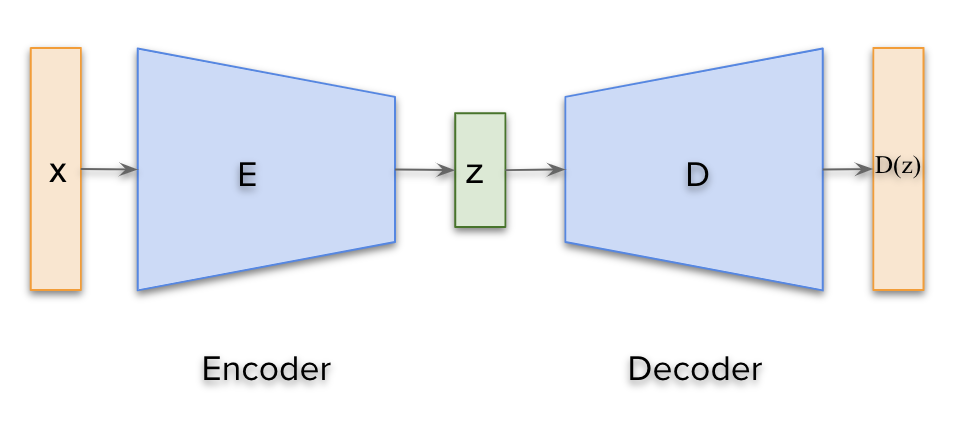

## How to use?
- Command 1: `python train.py train`  
- Command 2: `python train.py generate`  
- Command 3: `python train.py generate path/to/image`  

Note: Generated samples will be stored in `images/{ae_model}/` directory during training.

## Autoencoders

#### Traditional Autoencoders
The following papers are just examples on how to use the implemented autoencoders.  
We did not mean to implement what have been described in each paper.

- Vanilla AutoEncoder
	- [Learning Internal Representations by Error Propagation, 1986](https://web.stanford.edu/class/psych209a/ReadingsByDate/02_06/PDPVolIChapter8.pdf)
	- [Modular learning in neural networks, 1987](https://www.aaai.org/Papers/AAAI/1987/AAAI87-050.pdf)
- Stacked AutoEncoder
	- [Stacked autoencoders based machine learning for noise reduction and signal reconstruction in geophysical data, 2019](https://arxiv.org/pdf/1907.03278.pdf)
- Convolutional AE
	- [Stacked Convolutional Auto-Encoders for Hierarchical Feature Extraction, 2011](http://people.idsia.ch/~ciresan/data/icann2011.pdf)
	- [Deep Clustering with Convolutional Autoencoders, 2017](https://xifengguo.github.io/papers/ICONIP17-DCEC.pdf)
	- [Deep Convolutional AutoEncoder-based Lossy Image Compression, 2018](https://arxiv.org/pdf/1804.09535.pdf)
	- [A Better AutoEncoder for Image: Convolutional AutoEncoder, 2018](http://users.cecs.anu.edu.au/~Tom.Gedeon/conf/ABCs2018/paper/ABCs2018_paper_58.pdf)
- Regularized Sparse AE
	- [Sparse autoencoder, 2011](https://web.stanford.edu/class/cs294a/sparseAutoencoder_2011new.pdf)
	- [k-Sparse Autoencoders, 2014](https://arxiv.org/pdf/1312.5663v2.pdf)
	- [Why Regularized Auto-Encoders Learn Sparse Representation?, 2015](https://arxiv.org/pdf/1505.05561.pdf)
- Regularized Denoising AE
	- [Stacked Denoising Autoencoders, 2010](http://www.jmlr.org/papers/volume11/vincent10a/vincent10a.pdf)
	- [Collaborative Filtering with Stacked Denoising AutoEncoders and Sparse Inputs, 2016](https://hal.inria.fr/hal-01256422v1/document)
	- [Deep Learning with Stacked Denoising Auto-Encoder, 2019](https://www.mdpi.com/1996-1073/12/12/2445/pdf)

*AutoEncoder* | *Loss Function*
:---: | :--- |
**Vanilla_AE** 	| 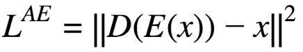
**Stacked_AE**	| 
**Conv_AE**		| 
**Sparse_AE**	| 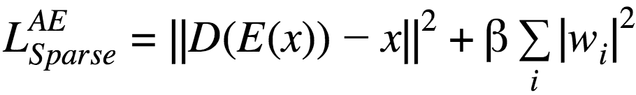
**Denoising_AE**	| 

#### Results for MNIST
The following results can be reproduced with command:  
```
python train.py train
```
Note: 1st and 3rd rows represent the ground truth whereas the 2nd and 4th rows are the generated ones.

*Name* | *Epoch 1* | *Epoch 15* | *Epoch 30*
:---: | :---: | :---: | :---: |
Vanilla_AE | 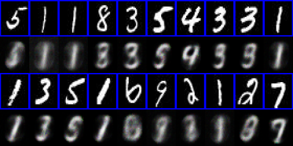 | 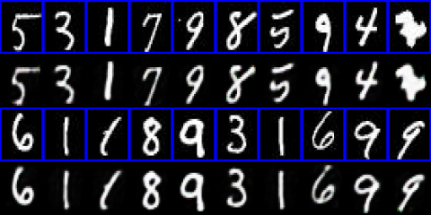 | 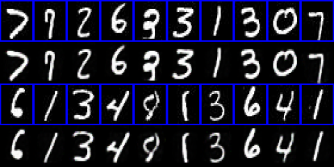
Stacked_AE | 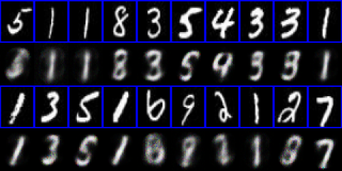 | 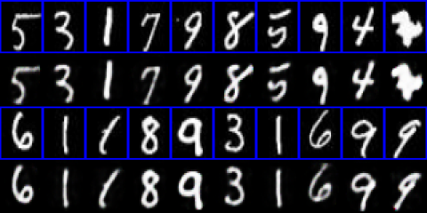 | 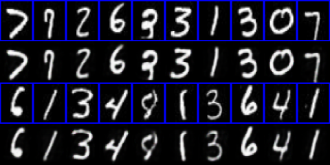
Conv_AE | 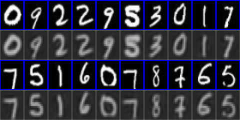 | 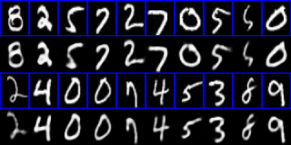 | 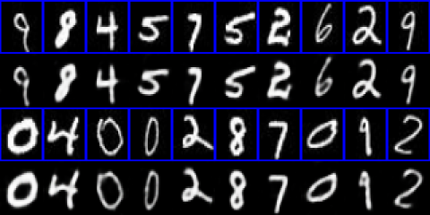
Sparse_AE | 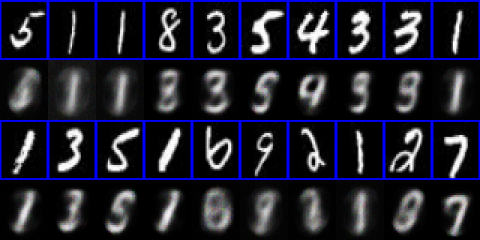 | 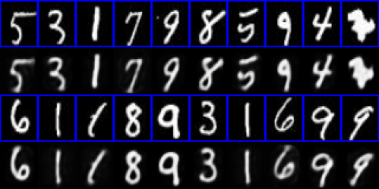 | 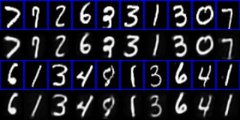
Denoising_AE | 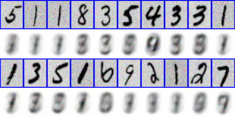 | 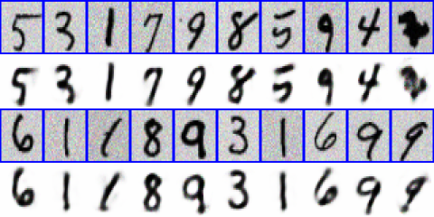 | 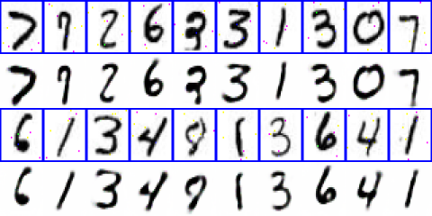

## Dependencies

1. Install miniconda <https://docs.conda.io/en/latest/miniconda.html>
2. Create an environment 	`conda create --name autoencoder`
3. Activate the environment `source activate autoencoder`
4. Install [Tensorflow] 	`conda install -c conda-forge tensorflow`
5. Install [Opencv] 		`conda install -c conda-forge opencv`
6. Install [sklearn] 		`conda install -c anaconda scikit-learn`
7. Install [matplotlib] 	`conda install -c conda-forge matplotlib`

## Datasets
If you wanna try new dataset, please make sure you make it in the following way:
- Dataset_main_directory
	- train_data
		- category_1:
			- image1
			- image2
			- ...
		- category_2:
			- image1
			- image2
			- ...
		- ...
	- test_data
		- category_1:
			- image1
			- image2
			- ...
		- category_2:
			- image1
			- image2
			- ...
		- ...
The `loader.py` file will automatically upload all images and their labels (category_i folders)

## Acknowledgements
This implementation has been based on the work of the great giants:
- https://github.com/hwalsuklee/tensorflow-generative-model-collections
- https://github.com/wiseodd/generative-models
- https://github.com/eriklindernoren/Keras-GAN
